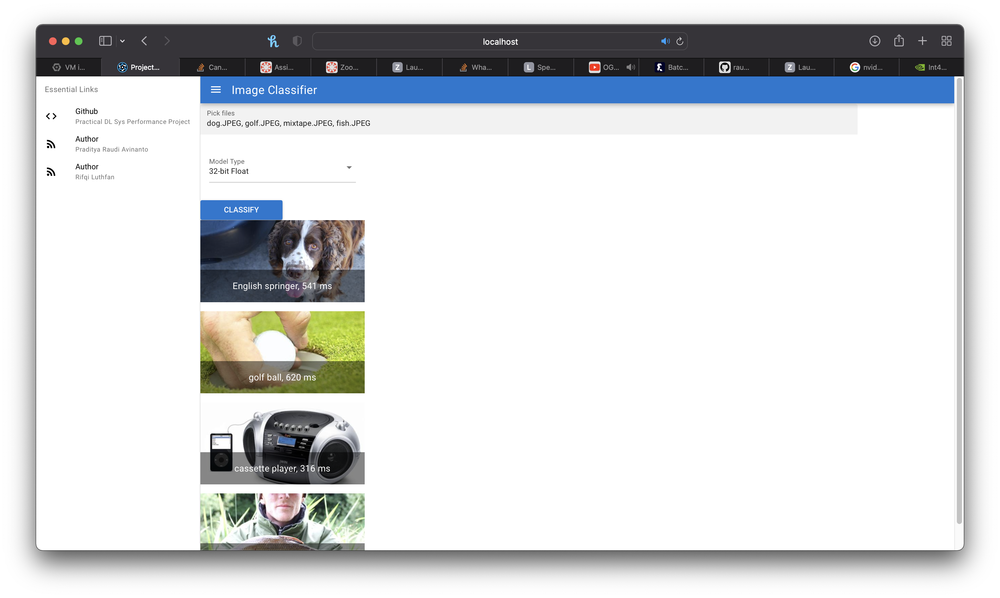

# Front End Quantization Project
Part of: [Quantization Module](https://github.com/rluthfan/pytorch-quantization) and [Back End Quantization Project](https://github.com/raudipra/back_end_quantization_project)

This repository contains frontend server codes for quantization project. Users can upload multiple images and choose available model to classify the images and then display the image with predicted label and inference time.

User Interface


## Install the dependencies
```bash
npm install
```

### Start the app in development mode (hot-code reloading, error reporting, etc.)
- Edit the API URL within src/pages/Index.vue, pointing to Back End Quantization Project Server.
```bash
quasar dev
```

### Lint the files
```bash
npm run lint
```

### Build the app for production
```bash
quasar build
```

### Customize the configuration
See [Configuring quasar.conf.js](https://quasar.dev/quasar-cli/quasar-conf-js).
